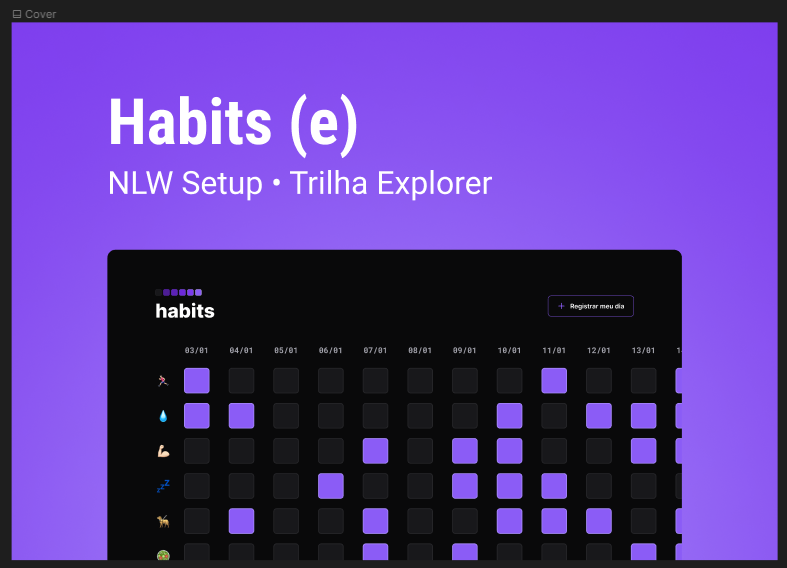

# nlw-setup 🦾🚀🖖

<li> Projeto aprtesentado pelo MAYK BRITO, vulgo "MAYKÃO"! e desenvolvido pelo mestre DIEGÃO rs, para acompanhar rotina e hábitos diários usando tecnologias de programação web com inputs e uma interface de design moderno e fácil uso!

##  😎 Technologies

<li> HTML
<li> CSS
<li> JavaScript
<li> Git and GitHub

<a target="_blank" href="https://robertojunnior.github.io/nlw-setup/">Clique aqui</a> para conferir o resultado atual.🚀

<h3> Abaixo imagens do projeto final do "Habits"! 🧑‍🚀
 
 

  

    
  

 
 
    
<h3> Obrigado por visitar meu Git e se chegou até aqui dê um "FOLLOW" que retribuo, quem sabe não podemos colaborar em algum projeto juntos?
   
   

 Até a próxima! - Bye 😁🖖.
