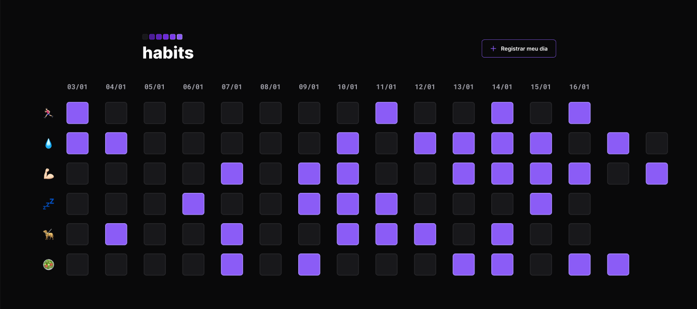

<h1 align="center"> Projeto Habits </h1>

NLW é um evento exclusivo e gratuito, promovido pela Rocketseat para ensino de tecnologias WEB.  

  <a href="#-tecnologias">Tecnologias</a>&nbsp;&nbsp;&nbsp;|&nbsp;&nbsp;&nbsp;
  <a href="#-projeto">Projeto</a>&nbsp;&nbsp;&nbsp;|&nbsp;&nbsp;&nbsp;
  <a href="#-layout">Layout</a>&nbsp;&nbsp;&nbsp;|&nbsp;&nbsp;&nbsp;
  <a href="#memo-licença">Licença</a>

  

 

  

    
  

 
 

 
🧑‍🚀 Este NLW-SETUP foi apresentado pelo MAYK BRITO, vulgo "MAYKÃO"! E o projeto desenvolvido no FIGMA pelo mestre DIEGÃO rs, para acompanhar rotina e hábitos diários usando tecnologias de programação web com inputs e uma interface de design moderno e fácil uso!

 

## 🚀 Tecnologias

Esse projeto foi desenvolvido com as seguintes tecnologias:

<li> HTML
<li> CSS
<li> JavaScript
<li> Git and GitHub
<li> Figma

## 💻 Projeto

O Habits é um app para ajudar a rastrear os hábitos.
Faça seus inputs diários de sua rotina, usando seu navegador como "Local Storage", assim os dados ficarão salvos sem precisar de um banco de dados.

- [Visite o projeto online](https://roberjunnior.github.io/nlw-setup)

## 🔖 Layout

Você pode visualizar o layout do projeto através [DESSE LINK](https://www.figma.com/community/file/1195327109778210238). 
É necessário ter conta no [Figma](https://figma.com) para acessá-lo.

## :memo: Licença

Esse projeto está sob a licença MIT.

---

Feito com ♥ by Rocketseat e construído aqui neste repositório por ninguém menos que o "Cabra" que vos fala, ops! Escreve 😁 :wave: [Participe da comunidade Rocketseat no DISCORD!](https://discord.gg/rocketseat)

    
<h4> Obrigado por visitar meu Git e se chegou até aqui dê um "FOLLOW" que retribuo, quem sabe não podemos colaborar em algum projeto juntos?
   
   

 Até a próxima! - Bye 😁🖖.
